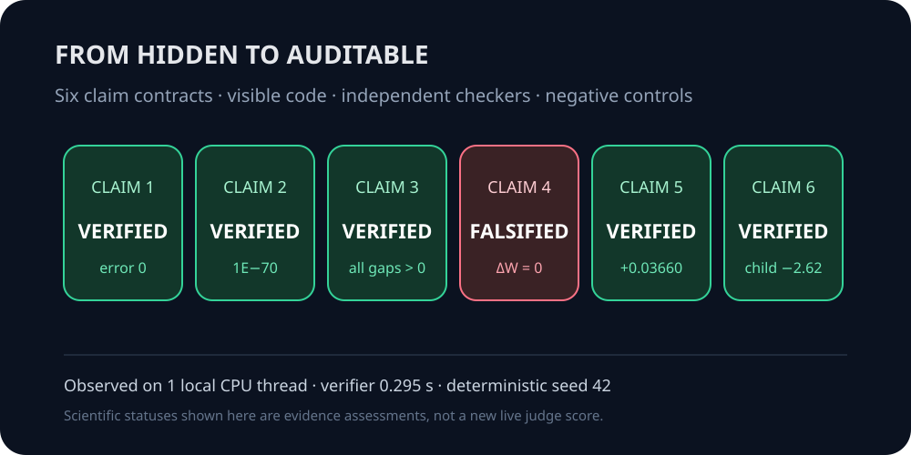
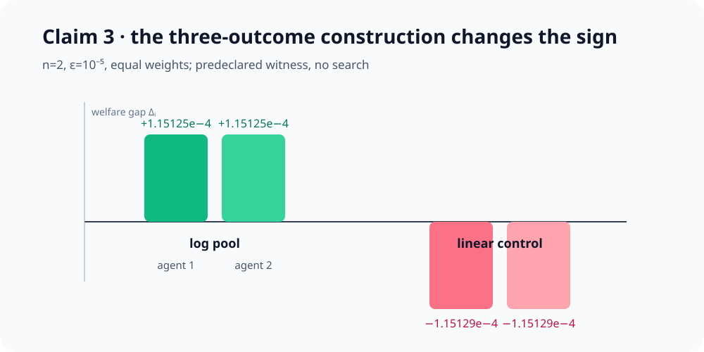
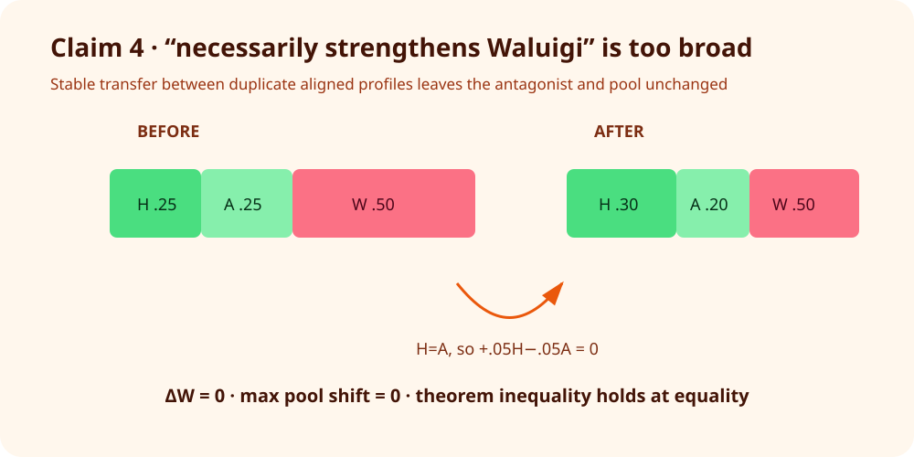
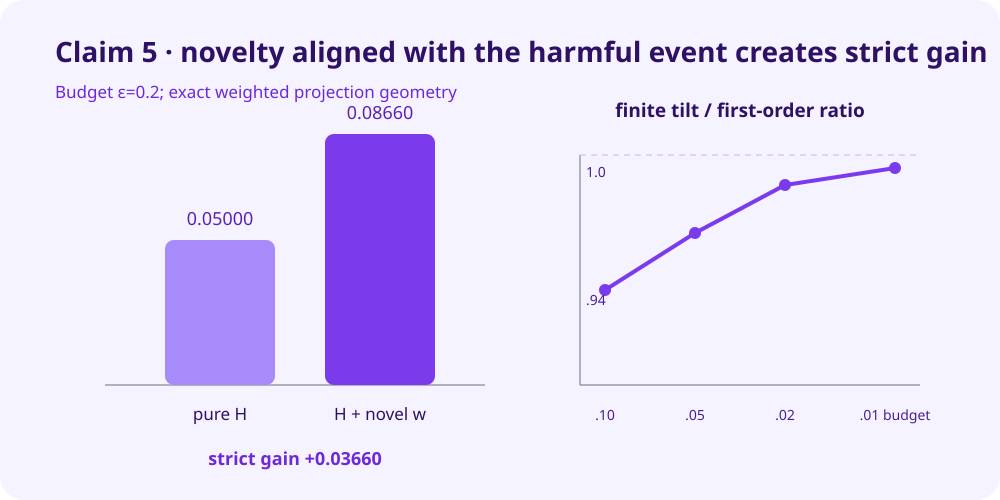
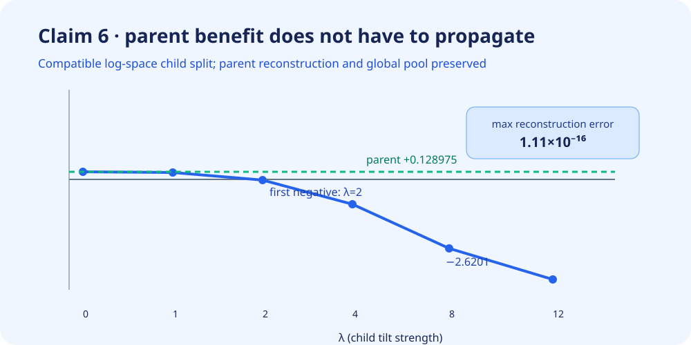

# From hidden toy checks to claim-level certificates



*Five claims are VERIFIED and the broad Claim 4 wording is FALSIFIED in the
current evidence package. These are scientific evidence statuses, not a new
live judge score; the live score remains 7/12 until reevaluation.*

## Central question

[Probabilistic Modeling of Latent Agentic Substructures in Deep Neural
Networks](https://arxiv.org/abs/2509.06701) treats an agent as a probability
distribution and uses log score as epistemic utility. Its core mathematical
question is whether an aggregate distribution can benefit its components,
whether that benefit survives recursive decomposition, and what low-dimensional
interventions imply for “Luigi/Waluigi” persona components.

The previous logbook had one accepted definition check and five numerical toy
checks whose implementations were hidden. This campaign reconstructed the
paper's exact definitions from arXiv:2509.06701v2, exposed all code, and
replaced sampling-based inference with analytic certificates or explicit
assumption-audited constructions.

| Claim | Paper statement tested | Observed evidence | Assessment |
|---|---|---|---|
| 1 | `U(o)=log P(o)` and expected utility is `-H(P)` | both errors `0.0` | VERIFIED |
| 2 | no strict unanimity under linear pooling | symmetric-KL certificate; Decimal residual `1E-70` | VERIFIED |
| 3 | strict unanimity exists for log pooling with ≥3 outcomes | four predeclared witnesses; minimum gap `1.11675e-4` | VERIFIED |
| 4 | broad paraphrase says manifesting Luigi must strengthen Waluigi | stable counterexample has `ΔW=0`, pool shift `0` | FALSIFIED |
| 5 | eliciting then suppressing adds a useful direction | first-order gain `0.03660254`; controls give zero | VERIFIED |
| 6 | parent benefit need not propagate to children | parent `+0.128975`, compatible child `-2.620105` | VERIFIED |

## Implementation path

The complete path is deliberately small:

```text
reproduction/run_all.py
  → reproduction/verifier.py
      → reproduction/math_core.py
      → reproduction/independent_checker.py
```

`math_core.py` implements normalization, log/linear pools, entropy, KL,
centered log profiles, weighted inner products, and a dependency-free Gram
projection. `verifier.py` encodes every claim contract and destructive
control. `independent_checker.py` reconstructs Claims 2–6 using 70-digit
`Decimal` arithmetic rather than calling verifier primitives. `run_all.py`
prints one complete JSON record and exits nonzero unless every claim and
control succeeds.

The fixed command on every experiment node was:

```bash
uv sync --locked --no-dev && .venv/bin/python -m reproduction.run_all
```

The environment has no runtime third-party dependencies and is pinned by
`pyproject.toml` and `uv.lock`. The winning cumulative run used one local CPU
thread, seed 42, 0.295 verifier seconds, 5 orchestrated seconds, and $0.
Git SHA: `c2b9aefefc290d44097b4bdd18d5e8e7cf707ba4`.

## Linear and logarithmic pooling

Claim 2 is universal, so finite trials cannot verify it. The replacement is a
machine-audited proof certificate. For a linear pool
`P=Σᵢ βᵢPᵢ`, each welfare gap is

`Δᵢ = H(Pᵢ) - H(P) - KL(P || Pᵢ)`.

Weighting and summing gives

`Σᵢ βᵢΔᵢ = -Σᵢ βᵢ[KL(Pᵢ || P) + KL(P || Pᵢ)]`.

The right side is strictly negative unless all agents are identical; in that
degenerate case every gap is zero. Either way all agents cannot strictly
benefit. Four numerical fixtures audit the implementation rather than stand in
for the proof. A control that drops the reverse-KL term breaks the identity,
and an identical-agent control removes strictness.

Claim 3 is existential, so an explicit paper construction is sufficient. With
`ε=10⁻⁵`, every distribution has full support and the witness is declared
before execution—there is no random search.



The correct logarithmic pool gives both agents a positive `1.15125e-4` gap.
Replacing it with a linear pool flips both signs. A separate binary-outcome
identity and a complete 24,255-case grid calibration found no binary strict
unanimity, consistent with the contrasting theorem.

## The exact limit of the Waluigi theorem

Theorem 19 states a compensation inequality. A strict increase in the unique
anti-aligned component follows only with additional conditions: the
anti-aligned component is unique, aligned components are not downweighted, and
the error/remainder is small enough. The broad judged wording omitted the
aligned-downweight restriction.



Use centered profiles `H=(1,-1,0)`, an aligned duplicate `A=H`, and
`W=(-1,1,0)`. Moving 0.05 weight from `A` to `H` manifests Luigi but changes
neither Waluigi's weight nor the aggregate log pool. The exact theorem
inequality holds at equality because its aligned-downweight term cancels the
Luigi term. An independent Decimal checker obtains zero to 70 digits; deleting
the cancellation term produces a false positive and is detected.

This **FALSIFIES the broad paraphrase**, not the paper's conditional
compensation inequality.

## Shattering as span geometry

The paper's Appendix reduces small-budget suppression of harmful event `A` to
the norm of the weighted projection of
`g_A = 1_A-P(A)` onto the available profile span. Adding a novel Waluigi
direction `w` creates residual `u=w-Proj_S(w)`. Strict improvement requires
both `u≠0` and `<g_A,u>≠0`.



On the four-outcome fixture, pure benevolence achieves `0.05` first-order
reduction, while the enlarged span achieves `0.08660254`. The Pythagorean
residual is zero. Finite exponential tilts converge toward the same
first-order prediction as the budget shrinks. Two distinct controls remove
strictness: one puts `w` inside the old span, and the other makes its novel
part event-orthogonal.

This is exact first-order span evidence, not a ten-step neural training
trajectory. The compact Appendix equality for the *difference* is not used
outside its valid special case; strictness follows from the preceding
Pythagorean identity.

## Recursive composition

Claim 6 is also existential. A nonuniform parent `P₁` strictly benefits from
the power-family pool `P_t`. It is then split in log space into children
`P₁₁,P₁₂` so their weighted log profiles reconstruct the parent up to a
normalizing constant. Consequently, the global log pool is preserved exactly.



The parent gap stays `+0.128975`. The first child's gap crosses below zero at
`λ=2` and reaches `-2.620105` at `λ=8`, while reconstruction and pool errors
remain at floating-point noise (`≤1.11e-16`). The 70-digit checker bounds both
by `2E-70`. A clone split keeps both children positive; an incompatible
one-sided tilt visibly breaks both invariants.

## Evidence, scope, and provenance

Every claim includes a JSON contract, source audit, method, raw JSON, separate
checker output, negative-control output, pinned environment, runtime/CPU
record, limitations, and `EVAL.md`. The evaluator-visible Space mirrors all of
these and links them from a canonical visibility matrix.

The paper source was arXiv:2509.06701v2, retrieved 2026-07-26 through the
ar5iv HTML endpoint with an explicit browser User-Agent. Archived SHA-256:
`013a579947622a09d4375d4d4d4cb18aa8c61728ed3070c83f084c40140f0282`.

Important experiment lineage:

- [judged 7/12 baseline](https://github.com/MachineLearning-Nerd/icml26-repro-sW8U2TYDMp-probabilistic-modeling-of-latent-agentic-substructures-in-deep-neural-networ/tree/orx/judged-7-of-12-baseline)
- [Claim 2 analytic certificate](https://github.com/MachineLearning-Nerd/icml26-repro-sW8U2TYDMp-probabilistic-modeling-of-latent-agentic-substructures-in-deep-neural-networ/tree/orx/claim-2-analytic-certificate)
- [Claim 3 constructive witness](https://github.com/MachineLearning-Nerd/icml26-repro-sW8U2TYDMp-probabilistic-modeling-of-latent-agentic-substructures-in-deep-neural-networ/tree/orx/claim-3-constructive-log-pooling)
- [Claim 4 exact compensation audit](https://github.com/MachineLearning-Nerd/icml26-repro-sW8U2TYDMp-probabilistic-modeling-of-latent-agentic-substructures-in-deep-neural-networ/tree/orx/claim-4-exact-compensation-law-audit)
- [Claim 5 shattering geometry](https://github.com/MachineLearning-Nerd/icml26-repro-sW8U2TYDMp-probabilistic-modeling-of-latent-agentic-substructures-in-deep-neural-networ/tree/orx/claim-5-first-order-shattering-geometry)
- [Claim 6 compatible recursive split](https://github.com/MachineLearning-Nerd/icml26-repro-sW8U2TYDMp-probabilistic-modeling-of-latent-agentic-substructures-in-deep-neural-networ/tree/orx/claim-6-compatible-recursive-split)

The conservative projected score range is **10–12/12**, and the
best-supported possible score is **12/12 as a forecast only**. The live score
remains **7/12**. Interpretation risk remains for the breadth of Claim 4 and
the first-order scope of Claim 5; no experiment here identifies actual latent
agents inside a trained neural network.
